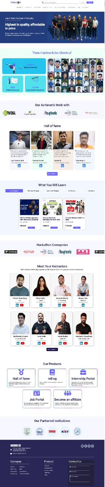

# Hey there , I am Amarjeet kumar

 

Live Link:- [Click here !](https://project-08-web-design-template.netlify.app/)

## For making this project I spend almost 3 hours.

## What I learned from this project

- Most important thing which i learned from this projecy is about position and .
- also I explore about backgroun color and linear ingrediant .
